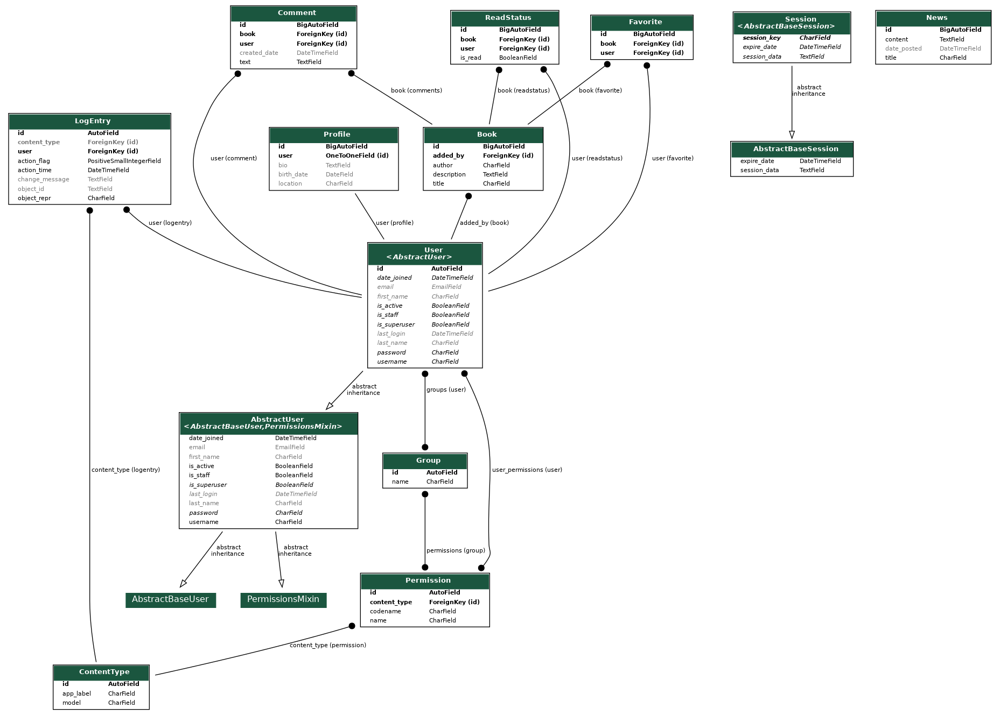

# Онлайн-магазин книг

## Описание проекта
Онлайн-магазин книг, позволяющий пользователям регистрироваться, создавать профили, добавлять книги в список избранного и получать уведомления о новых поступлениях.

## Функциональные требования
1. Регистрация пользователей с возможностью входа в личный кабинет.
2. Личный кабинет пользователя с возможностью добавления книг в избранное (находится на вкладке "Избранное").
3. Новостная лента с информацией о новых поступлениях в магазине (находится на главной странице).
4. Возможность добавления книг в админке и вывод всех книг в ленту.
5. Возможность просмотра каталога книг (находится на вкладке "Каталог").
6. Уведомления о поступлении новых книг отображаются в новостной ленте.
7. Расширенные данные пользователя (добавлена модель профиля).
8. Функционал поиска по существующим книгам.
9. Возможность оставлять комментарии к книгам.
10. Книги в профиле могут быть отмечены как прочитанные или непрочитанные.

### Дополнительные функции (вне технического задания)
11. Логирование.
12. Тестирование.
13. Команда для создания случайных книг, комментариев и пользователей для тестирования, а также случайного добавления книг в список избранных и прочитанных.
14. Графические индикаторы для книг, добавленных в избранное и прочитанных, статистика о количестве прочитанных книг и добавленных в избранное.

## Техническая реализация
- Диаграмма UML: 
- База данных: PostgreSQL
- Документация Swagger: Интегрирована
- Докеризация: Приложение и база данных упакованы в Docker

## Как запустить проект


1. Клонируйте репозиторий:

HTTPS
```
https://github.com/thetimkri/test_task_book_store.git
```
SSH 
```
git@github.com:thetimkri/test_task_book_store.git
```
GitHub CLI
```
gh repo clone thetimkri/test_task_book_store
```

2. Настройти конфигурация .env
В проекте имеется шаблон файла .env:
```
DJANGO_SECRET_KEY=your-secret-key
DJANGO_DEBUG=False
DATABASE_NAME=bookstore_db
DATABASE_USER=admin
DATABASE_PASSWORD=admin
DATABASE_HOST=localhost
DJANGO_ALLOWED_HOSTS=example.com,www.example.com
```

Создайте свой собственный файл .env в корне проекта. На данный момент в settings.py оставлена информация по умолчанию, что позволяет запустить проект без использования .env, но это решение не является безопасным.


2. Для локального запуска проекта:

Перейдите в директорию проекта:
```
cd book_store
```
Выолните код для запуска сервера
```
python manage.py runserver
```


3. Для запуска в Docker:
```
docker-compose up --build
```


## Команды для тестирования и генерации данных
- Для создания случайных книг, комментариев и пользователей для тестирования локально:
```
python manage.py create_random_data
```


- Для создания случайных книг, комментариев и пользователей для тестирования в Docker:
```
docker-compose up --build -d && docker-compose exec web python manage.py create_random_data
```
- Для автоматического создания диаграммы UML локально:
```
python manage.py graph_models -a -o myapp_models.png
```

- Для автоматического создания диаграммы UML в Docker:
```
docker-compose up --build -d && docker-compose exec web python manage.py graph_models -a -o myapp_models.png
```

## Автор
- [timkri](https://github.com/thetimkri/)